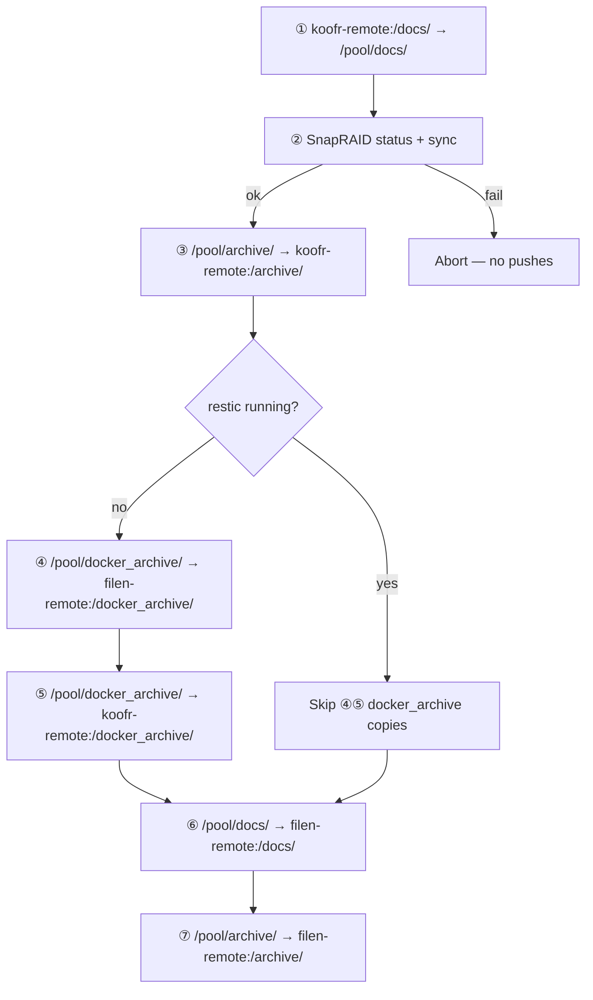
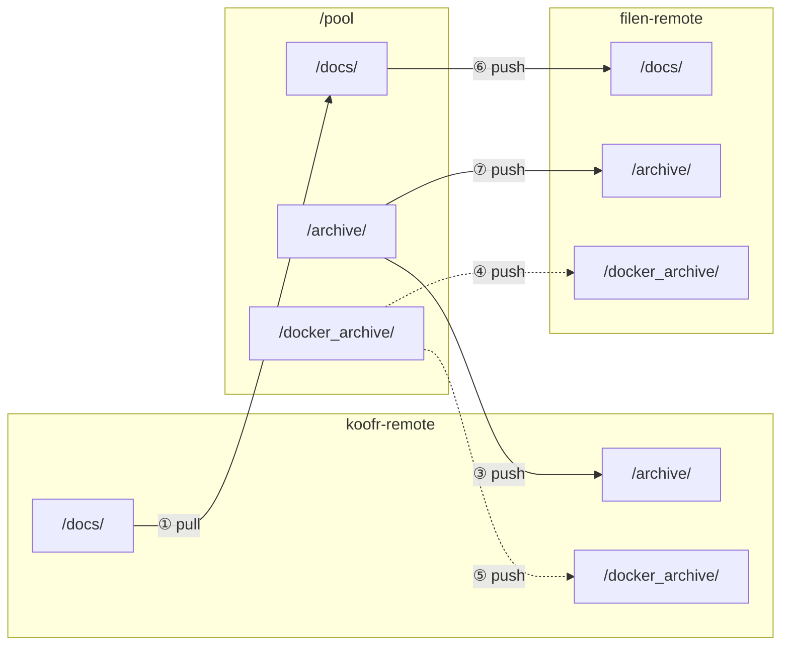
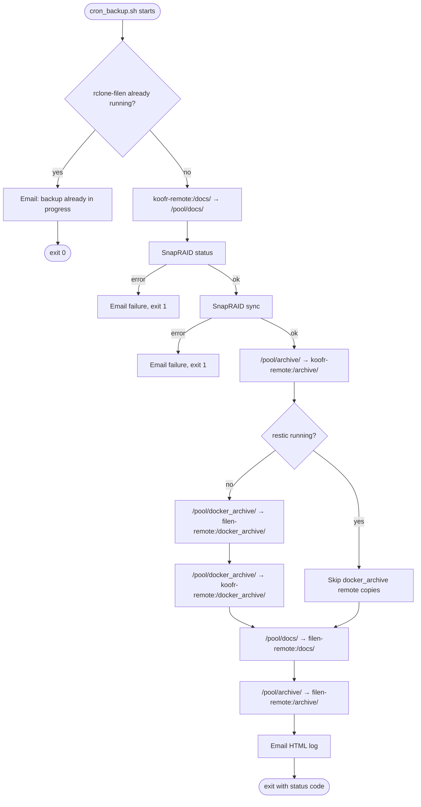
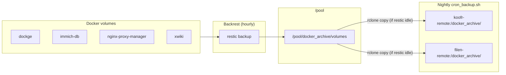

# Backup

Scheduled backups on NAS-DEV are driven by `/usr/local/bin/cron_backup.sh` (also tracked in the repo at `nas-dev/scripts/cron_backup.sh`). Docker volume snapshots are produced separately by [Backrest](https://github.com/garethgeorge/backrest) on an hourly schedule.

## Overview

| Component | Role |
| --------- | ---- |
| `cron_backup.sh` | Nightly (cron) orchestration: SnapRAID checks, rclone copies, email report |
| Backrest / restic | Hourly Docker volume backups into `/pool/docker_archive/volumes` |
| SnapRAID | Parity sync before off-site copies; aborts backup if unhealthy |
| `rclone-filen` | rclone binary used for Koofr and Filen remotes |
| `koofr-remote` | Koofr cloud storage |
| `filen-remote` | Filen cloud storage (secondary copy) |

On completion (success or failure), the script emails an HTML log to `nas-dev@bitrealm.dev`.

## `/pool` off-site sync (Koofr & Filen)

Each nightly run copies three paths under `/pool` to cloud storage. Koofr and Filen are not mirrors of each other — each path has a specific role on each remote.

| `/pool` path | Koofr | Filen | Notes |
| ------------ | ----- | ----- | ----- |
| `/pool/docs/` | **pull** at start | **push** after SnapRAID | Koofr is the docs source of truth; Filen gets a copy |
| `/pool/archive/` | **push** | **push** | Both remotes receive the same archive tree |
| `/pool/docker_archive/` | **push** (if restic idle) | **push** (if restic idle) | Skipped while Backrest/restic is writing snapshots |

All **push** copies run only after SnapRAID `status` and `sync` succeed. If either fails, every push is skipped.

### Copy order

Operations run in this sequence every night:

### Path map

Where each `/pool` tree flows relative to the two remotes:

Solid arrows always run (after SnapRAID passes). Dotted arrows run only when `restic` is **not** running.

### Per-path detail

**`/pool/docs/`** — Koofr pulls down first; Filen receives the result afterward. Docs are never pushed back to Koofr in this script. Any local-only edits on the NAS are overwritten by the Koofr pull.

**`/pool/archive/`** — Pushed to Koofr first, then to Filen. Both remotes should end up with the same content.

**`/pool/docker_archive/`** — Filled hourly by Backrest/restic. Pushed to Filen, then Koofr, but only when no `restic` process is active. Avoids uploading partially-written snapshots.

## Full backup flow

## Upstream: Docker volume backups

Backrest runs restic hourly (`0 * * * *`) and writes repository data under `/pool/docker_archive/volumes`. The cron script comment notes that this is what populates `/pool/docker_archive` before the nightly rclone push.

Backed-up paths (from Backrest config):

- `/mnt/dockge_dockge_data`
- `/mnt/immich_immich-db`
- `/mnt/nginx-proxy-manager_data`
- `/mnt/nginx-proxy-manager_letsencrypt`
- `/mnt/xwiki_mariadb-data`
- `/mnt/xwiki_xwiki-data`

## rclone settings

The script sets these defaults for all copy operations:

- `RCLONE_DISABLE_HTTP2=true`
- `RCLONE_TRANSFERS=16`
- Log level: `INFO`

## Safety gates

| Check | On failure |
| ----- | ---------- |
| Another `rclone-filen` process running | Exit 0, email "backup already in progress" |
| SnapRAID `status` | Exit 1, skip all copies |
| SnapRAID `sync` | Exit 1, skip all copies |
| `restic` running during docker_archive copies | Skip docker_archive copies to Koofr and Filen only |

SnapRAID `scrub` is present in the script but commented out.
