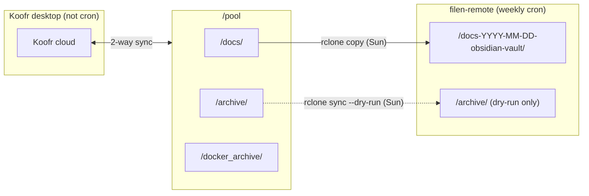
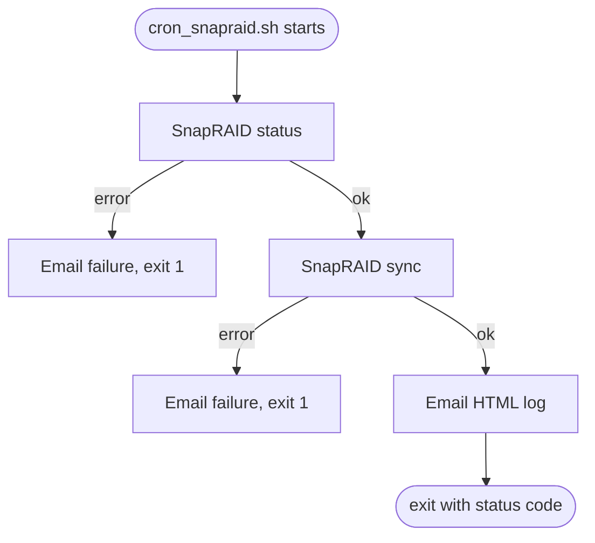
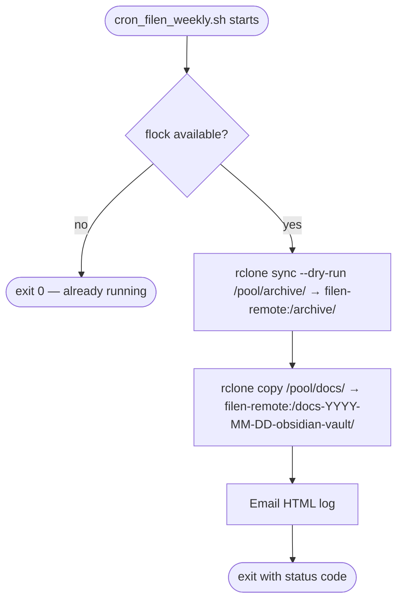
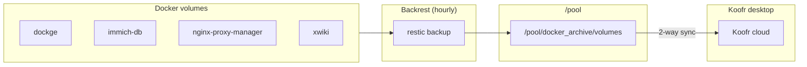

# Backup

Scheduled backups on NAS-DEV are driven by two cron scripts: `/usr/local/bin/cron_snapraid.sh` (daily SnapRAID) and `/usr/local/bin/cron_filen_weekly.sh` (weekly Filen jobs). Docker volume snapshots are produced separately by [Backrest](https://github.com/garethgeorge/backrest) on an hourly schedule.

## Table of contents

- [Overview](#overview)
- [Cron schedule](#cron-schedule)
- [Off-site sync](#off-site-sync)
- [Daily SnapRAID flow](#daily-snapraid-flow)
- [Weekly Filen flow](#weekly-filen-flow)
- [Upstream: Docker volume backups](#upstream-docker-volume-backups)
- [rclone settings](#rclone-settings)
- [Safety gates](#safety-gates)
- [Deploy on NAS](#deploy-on-nas)

## Overview

| Component | Role |
| --------- | ---- |
| `cron_snapraid.sh` | Daily (00:00): SnapRAID status + sync; email report |
| `cron_filen_weekly.sh` | Weekly (Sun 00:30): Filen archive dry-run + dated Obsidian vault copy; email report |
| Backrest / restic | Hourly Docker volume backups into `/pool/docker_archive/volumes` |
| SnapRAID | Parity sync before off-site copies; aborts backup if unhealthy |
| Koofr desktop app | 2-way sync of entire `/pool/` with Koofr cloud (not cron) |
| `/usr/bin/rclone` | Used by weekly Filen script only |
| `filen-remote` | Filen cloud storage (archive verification + dated docs snapshots) |

On completion (success or failure), each script emails an HTML log to `nas-dev@bitrealm.dev`.

## Cron schedule

NAS-DEV crontab entries for backup and SnapRAID maintenance:

```cron
#0 4 * * * /usr/local/bin/snapraid_sync.sh          # disabled - sync handled by cron_snapraid.sh
0 0 * * * /usr/local/bin/cron_snapraid.sh >/dev/null 2>&1
30 0 * * 0 /usr/local/bin/cron_filen_weekly.sh >/dev/null 2>&1
0 3 * * 0 /usr/local/bin/snapraid_scrub.sh >/dev/null 2>&1
```

| Schedule | Script | Role |
| -------- | ------ | ---- |
| Daily 00:00 | `cron_snapraid.sh` | SnapRAID status + sync |
| Sunday 00:30 | `cron_filen_weekly.sh` | Filen archive dry-run + dated `/pool/docs` copy |
| Sunday 03:00 | `snapraid_scrub.sh` | SnapRAID status + 10% scrub; emails `snapraid@bitrealm.dev` |
| Hourly (`0 * * * *`) | Backrest / restic | Docker volume snapshots (see [Upstream](#upstream-docker-volume-backups)) |

`snapraid_sync.sh` is commented out because nightly sync is already performed inside `cron_snapraid.sh`. `snapraid_maint.sh` in `nas-dev/scripts/archive/` is not scheduled.

Repo copies: [`nas-dev/scripts/cron_snapraid.sh`](../nas-dev/scripts/cron_snapraid.sh), [`nas-dev/scripts/cron_filen_weekly.sh`](../nas-dev/scripts/cron_filen_weekly.sh), [`nas-dev/scripts/snapraid_scrub.sh`](../nas-dev/scripts/snapraid_scrub.sh). Storage layout and SMART checks: [disks.md](disks.md).

## Off-site sync

Koofr and Filen serve different roles. Koofr desktop handles day-to-day 2-way sync of `/pool/`; Filen receives weekly archive verification and dated Obsidian vault snapshots.

| `/pool` path | Koofr | Filen | Notes |
| ------------ | ----- | ----- | ----- |
| `/pool/` (entire pool) | **2-way** via Koofr desktop app | — | Not driven by cron |
| `/pool/docs/` | **2-way** via Koofr desktop app | **dated copy** weekly | Each Sunday: `docs-YYYY-MM-DD-obsidian-vault` on Filen |
| `/pool/archive/` | **2-way** via Koofr desktop app | **dry-run verify** weekly | `rclone sync --dry-run` reports drift; no writes |
| `/pool/docker_archive/` | **2-way** via Koofr desktop app | — | Filled hourly by Backrest/restic |


```mermaid
flowchart LR
    subgraph koofr["Koofr desktop (not cron)"]
        KC["Koofr cloud"]
    end

    subgraph pool["/pool"]
        PD["/docs/"]
        PA["/archive/"]
        PDA["/docker_archive/"]
    end

    subgraph filen["filen-remote (weekly cron)"]
        FD["/docs-YYYY-MM-DD-obsidian-vault/"]
        FA["/archive/ (dry-run only)"]
    end

    KC <-->|"2-way sync"| pool
    PD -->|"rclone copy (Sun)"| FD
    PA -.->|"rclone sync --dry-run (Sun)"| FA
```

Solid arrow: weekly dated copy. Dotted arrow: dry-run verification only (no writes to Filen).

## Daily SnapRAID flow


```mermaid
flowchart TD
    START([cron_snapraid.sh starts]) --> STATUS[SnapRAID status]
    STATUS -->|error| ABORT_STATUS[Email failure, exit 1]
    STATUS -->|ok| SYNC[SnapRAID sync]
    SYNC -->|error| ABORT_SYNC[Email failure, exit 1]
    SYNC -->|ok| MAIL[Email HTML log]
    MAIL --> END([exit with status code])
```

No rclone operations run in the daily job. Koofr desktop keeps `/pool` in sync independently.

## Weekly Filen flow


```mermaid
flowchart TD
    START([cron_filen_weekly.sh starts]) --> LOCK{flock available?}
    LOCK -->|no| END_BUSY([exit 0 — already running])
    LOCK -->|yes| DRY["rclone sync --dry-run /pool/archive/ → filen-remote:/archive/"]
    DRY --> COPY["rclone copy /pool/docs/ → filen-remote:/docs-YYYY-MM-DD-obsidian-vault/"]
    COPY --> MAIL[Email HTML log]
    MAIL --> END([exit with status code])
```

**Archive dry-run** — logs what would change if a real sync ran. The output is the deliverable; Filen is not modified.

**Docs snapshot** — each Sunday creates a new dated remote folder (e.g. `docs-2026-07-06-obsidian-vault`). Prior weeks' copies are never overwritten.

Concurrency uses `flock` on `/var/lock/cron_filen_weekly.lock` (not `pgrep rclone`, which would match the Koofr mount helper).

## Upstream: Docker volume backups

Backrest runs restic hourly (`0 * * * *`) and writes repository data under `/pool/docker_archive/volumes`. Koofr desktop 2-way syncs `/pool/docker_archive/` off-site; no cron rclone push is needed.


```mermaid
flowchart LR
    subgraph sources["Docker volumes"]
        dockge[dockge]
        immich[immich-db]
        npm[nginx-proxy-manager]
        xwiki[xwiki]
    end

    subgraph backrest["Backrest (hourly)"]
        restic[restic backup]
    end

    subgraph pool["/pool"]
        da["/pool/docker_archive/volumes"]
    end

    subgraph offsite["Koofr desktop"]
        koofr[Koofr cloud]
    end

    sources --> restic
    restic --> da
    da -->|"2-way sync"| koofr
```

Backed-up paths (from Backrest config):

- `/mnt/dockge_dockge_data`
- `/mnt/immich_immich-db`
- `/mnt/nginx-proxy-manager_data`
- `/mnt/nginx-proxy-manager_letsencrypt`
- `/mnt/xwiki_mariadb-data`
- `/mnt/xwiki_xwiki-data`

## rclone settings

The weekly Filen script sets these defaults:

- `RCLONE_DISABLE_HTTP2=true`
- `RCLONE_TRANSFERS=16`
- Log level: `INFO`
- Binary: `/usr/bin/rclone`

## Safety gates

| Check | Script | On failure |
| ----- | ------ | ---------- |
| SnapRAID `status` | `cron_snapraid.sh` | Exit 1, email failure |
| SnapRAID `sync` | `cron_snapraid.sh` | Exit 1, email failure |
| `flock` on `/var/lock/cron_filen_weekly.lock` | `cron_filen_weekly.sh` | Exit 0 (another instance running) |
| rclone dry-run or copy errors | `cron_filen_weekly.sh` | Exit 1, email failure |

Weekly SnapRAID scrub runs via `snapraid_scrub.sh` (not in `cron_snapraid.sh`).

## Deploy on NAS

After merging changes, on `nas-dev`:

```bash
sudo cp ~/repo/homelab/nas-dev/scripts/cron_snapraid.sh /usr/local/bin/
sudo cp ~/repo/homelab/nas-dev/scripts/cron_filen_weekly.sh /usr/local/bin/
sudo chmod +x /usr/local/bin/cron_snapraid.sh /usr/local/bin/cron_filen_weekly.sh
crontab -e   # add Sunday line if not present; daily line unchanged
```

Target crontab (repo documents intent; actual `crontab -e` is on the NAS, not in git):

```cron
0 0 * * * /usr/local/bin/cron_snapraid.sh >/dev/null 2>&1
30 0 * * 0 /usr/local/bin/cron_filen_weekly.sh >/dev/null 2>&1
```
