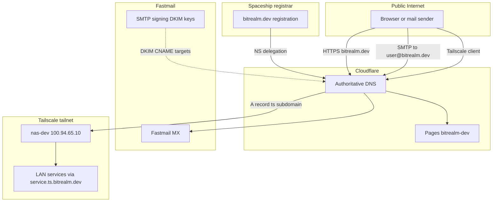

# bitrealm.dev

## Table of contents

- [Overview](#overview)
- [Who manages what](#who-manages-what)
- [Spaceship](#spaceship)
- [Cloudflare](#cloudflare)
  - [Authoritative DNS](#authoritative-dns)
  - [DNS records](#dns-records)
  - [Pages](#pages)
- [Fastmail](#fastmail)
  - [Inbound](#inbound)
  - [Outbound authentication](#outbound-authentication)
  - [Why Fastmail shows Inactive](#why-fastmail-shows-inactive)
  - [Verify DKIM](#verify-dkim)
  - [Manual DNS checklist](#manual-dns-checklist)
- [Tailscale](#tailscale)
- [Traffic flow](#traffic-flow)
- [Related docs](#related-docs)

## Overview

`bitrealm.dev` is split across Spaceship (registrar), Cloudflare (DNS and website), Fastmail (email), and Tailscale (private homelab access). The domain is registered at Spaceship and uses Cloudflare as the authoritative DNS host. The website at `bitrealm.dev` is served by [Cloudflare Pages](#pages) (`bitrealm-dev.pages.dev`); [email records](#dns-records) in Cloudflare point at [Fastmail](#fastmail), which does not host DNS; and [`*.ts.bitrealm.dev`](#tailscale) resolves to `nas-dev` over Tailscale for private homelab access.

Remote access to LAN services uses Tailscale (`<service>.ts.bitrealm.dev`), not Cloudflare Tunnel. See [Hosted Services](hosted_services_vm.md) for the legacy cloudflared approach.

## Who manages what

| Provider | Role | Manages | Key settings |
| -------- | ---- | ------- | ------------ |
| [Spaceship](https://www.spaceship.com) | Registrar | Domain registration, NS delegation | [Spaceship](#spaceship) |
| [Cloudflare](https://dash.cloudflare.com) | DNS + Pages | All public DNS records; static site hosting | [Authoritative DNS](#authoritative-dns), [DNS records](#dns-records), [Pages](#pages) |
| [Fastmail](https://www.fastmail.com) | Mail | Mailboxes, inbound MX, outbound SMTP signing | [Inbound](#inbound), [Outbound authentication](#outbound-authentication), [Manual DNS checklist](#manual-dns-checklist) |
| [Tailscale](https://login.tailscale.com/admin) | Private access | `nas-dev` tailnet, Magic DNS | [Tailscale](#tailscale) |

Outbound mail from `nas-dev` (cron alerts, system mail) relays through Fastmail SMTP. See [Postfix Mail](postfix_mail.md).

## Spaceship

Spaceship is the domain registrar. It delegates DNS to Cloudflare by setting these nameservers:

- `nena.ns.cloudflare.com`
- `rocco.ns.cloudflare.com`

Fastmail's setup wizard asks for `ns1.messagingengine.com` and `ns2.messagingengine.com` — that is only required if you want **Fastmail to host DNS**. This setup intentionally does not do that. Cloudflare remains authoritative; mail records are copied into Cloudflare manually.

## Cloudflare

Cloudflare hosts authoritative DNS and the public website. All live DNS records and the Pages deployment are managed in the Cloudflare dashboard.

### Authoritative DNS

| Setting | Value |
| ------- | ----- |
| Zone | `bitrealm.dev` |
| DNS host | Cloudflare |
| Nameservers | `nena.ns.cloudflare.com`, `rocco.ns.cloudflare.com` |
| NS delegation | Set at [Spaceship](#spaceship) |
| SOA | `nena.ns.cloudflare.com` (managed by Cloudflare) |

### DNS records

Exported 2026-06-13. These are the live records that make everything work.

| Type | Name | Value | Proxy | Purpose |
| ---- | ---- | ----- | ----- | ------- |
| NS | `bitrealm.dev` | `nena.ns.cloudflare.com` | — | Cloudflare authoritative |
| NS | `bitrealm.dev` | `rocco.ns.cloudflare.com` | — | Cloudflare authoritative |
| CNAME | `bitrealm.dev` | `bitrealm-dev.pages.dev` | Proxied | Static site → [Pages](#pages) |
| MX | `bitrealm.dev` | `10 in1-smtp.messagingengine.com` | — | Inbound mail → [Fastmail](#inbound) |
| MX | `bitrealm.dev` | `20 in2-smtp.messagingengine.com` | — | Inbound mail failover |
| TXT | `bitrealm.dev` | `v=spf1 include:spf.messagingengine.com ~all` | — | [SPF](#outbound-authentication) |
| TXT | `_dmarc.bitrealm.dev` | `v=DMARC1; p=none;` | — | [DMARC](#outbound-authentication) |
| CNAME | `fm1._domainkey.bitrealm.dev` | `fm1.bitrealm.dev.dkim.fmhosted.com` | DNS only | [DKIM](#outbound-authentication) |
| CNAME | `fm2._domainkey.bitrealm.dev` | `fm2.bitrealm.dev.dkim.fmhosted.com` | DNS only | [DKIM](#outbound-authentication) |
| CNAME | `fm3._domainkey.bitrealm.dev` | `fm3.bitrealm.dev.dkim.fmhosted.com` | DNS only | [DKIM](#outbound-authentication) |
| A | `*.ts.bitrealm.dev` | `100.94.65.10` | DNS only | [Tailscale](#tailscale) → `nas-dev` |

### Pages

`bitrealm.dev` is a proxied CNAME to `bitrealm-dev.pages.dev`. Cloudflare handles TLS termination and CDN at the edge. The static site source is deployed via Cloudflare Pages.

## Fastmail

Fastmail provides `@bitrealm.dev` mailboxes and SMTP. DNS records pointing at Fastmail are configured in [Cloudflare](#dns-records), not in Fastmail's DNS panel.

### Inbound

MX records in Cloudflare deliver mail to Fastmail's `messagingengine.com` hosts. Mailboxes and aliases are managed in the Fastmail admin panel.

### Outbound authentication

SPF, DMARC, and DKIM records live in **Cloudflare**, not in Fastmail's DNS panel:

- **SPF** — `v=spf1 include:spf.messagingengine.com ~all` authorizes Fastmail to send on behalf of `bitrealm.dev`
- **DKIM** — `fm1`–`fm3._domainkey` CNAMEs point at Fastmail's signing keys; receiving servers use these to verify mail is legitimate
- **DMARC** — `p=none` monitors alignment without rejecting mail

### Why Fastmail shows "Inactive"

Fastmail reports the domain as **Inactive** / **NS records not pointing to Fastmail** because [NS delegation](#spaceship) was never switched to `messagingengine.com`. That is expected and correct for this architecture. Mail works because the required MX, SPF, and DKIM records exist in Cloudflare.

Fastmail's **Customize DNS** panel lists records (including a fourth `mesmtp._domainkey` CNAME) but marks most as disabled. That panel only applies when Fastmail hosts DNS. The records that matter are the copies in Cloudflare. `mesmtp._domainkey` is [deprecated by Fastmail](https://www.fastmail.help/hc/en-us/articles/360060591153-Manual-DNS-configuration) (pre-2018 domains only) — you do not need to add it.

### Verify DKIM

```bash
dig +short CNAME fm1._domainkey.bitrealm.dev
# fm1.bitrealm.dev.dkim.fmhosted.com.
```

If that returns the Fastmail target, the CNAME is active regardless of what Fastmail's DNS panel shows.

### Manual DNS checklist

Per [Fastmail's manual DNS configuration](https://www.fastmail.help/hc/en-us/articles/360060591153-Manual-DNS-configuration), records fall into three groups: **required for mail**, **optional convenience**, and **skip** (conflicts with this setup).

#### Required for mail — already configured

| Fastmail record | Cloudflare status | Notes |
| --------------- | ----------------- | ----- |
| MX `in1-smtp.messagingengine.com` (10) | Present | Inbound mail primary |
| MX `in2-smtp.messagingengine.com` (20) | Present | Inbound mail failover |
| CNAME `fm1._domainkey` → `fm1.{domain}.dkim.fmhosted.com` | Present | DKIM |
| CNAME `fm2._domainkey` → `fm2.{domain}.dkim.fmhosted.com` | Present | DKIM |
| CNAME `fm3._domainkey` → `fm3.{domain}.dkim.fmhosted.com` | Present | DKIM |
| TXT SPF `v=spf1 include:spf.messagingengine.com …all` | Present | Uses `~all` (softfail); Fastmail docs show `?all` (neutral). `~all` is stricter and fine |
| TXT `_dmarc` `v=DMARC1; p=none;` | Present | DMARC monitoring |

#### Do not add

| Fastmail record | Why skip |
| --------------- | -------- |
| CNAME `mesmtp._domainkey` | **Deprecated** — only for domains hosted at Fastmail before 2018 |
| CNAME `www` → `web.fastmail.com` | Website is on [Cloudflare Pages](#pages), not Fastmail file storage |
| CNAME `*` → `web.fastmail.com` | Wildcard would conflict with `*.ts.bitrealm.dev` and other subdomains |
| A records for `@` / `*` (Fastmail IPs) | Root is a CNAME to Pages; do not add competing A records |

#### Optional — add only if you want the feature

| Fastmail record | Purpose | Trade-off |
| --------------- | ------- | --------- |
| SRV `_submission._tcp`, `_imaps._tcp`, `_submissions._tcp`, etc. | Email client autodiscovery for `@bitrealm.dev` accounts | Nice for phones/laptops setting up mail automatically; not required if you configure clients manually |
| CNAME `mail.bitrealm.dev` → `mail.fastmail.com` | Webmail login at `mail.bitrealm.dev` | Cosmetic URL only; `fastmail.com` login still works |
| SRV `_carddavs._tcp`, `_caldavs._tcp` | Contacts/calendar autodiscovery | Only useful if clients discover CardDAV/CalDAV via DNS |

**Bottom line:** Core mail delivery and signing are covered. You do not need `mesmtp._domainkey`. SRV and `mail.` records are optional quality-of-life additions.

## Tailscale

Private homelab services are reached over Tailscale, not the public internet.

| Setting | Value |
| ------- | ----- |
| Tailnet machine | `nas-dev` (`100.94.65.10`) |
| DNS pattern | `<service>.ts.bitrealm.dev` |
| Cloudflare record | `*.ts.bitrealm.dev` A → `100.94.65.10` (DNS only, not proxied) |

A Tailscale client resolves e.g. `jellyfin.ts.bitrealm.dev` via [Cloudflare DNS](#dns-records) to `nas-dev`'s Tailscale IP, then connects over the tailnet. `nas-dev` advertises subnet routes for the LAN. IP forwarding is enabled on the host — see [Router](router.md).

Cloudflare Tunnel (`cloudflared`) is no longer used for remote access.

## Traffic flow



## Related docs

- [Postfix Mail](postfix_mail.md) — outbound mail relay from `nas-dev`
- [Router](router.md) — Tailscale subnet routing / IP forwarding
- [Hosted Services](hosted_services_vm.md) — legacy Cloudflare Tunnel approach
