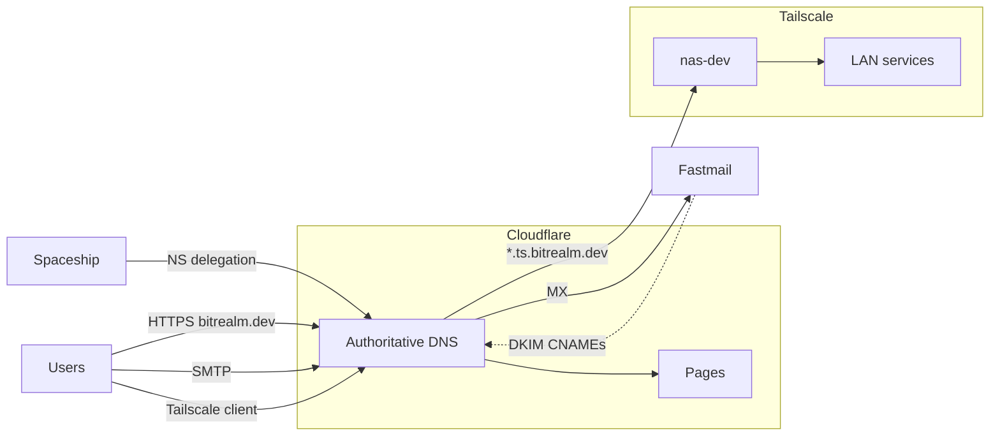

# bitrealm.dev

## Table of contents

- [bitrealm.dev](#bitrealmdev)
  - [Table of contents](#table-of-contents)
  - [Overview](#overview)
  - [Spaceship](#spaceship)
  - [Cloudflare](#cloudflare)
    - [Authoritative DNS](#authoritative-dns)
    - [DNS records](#dns-records)
    - [Website](#website)
  - [Fastmail](#fastmail)
    - [Outbound mail authentication](#outbound-mail-authentication)
    - [Manual DNS checklist](#manual-dns-checklist)
      - [Required for mail — already configured](#required-for-mail--already-configured)
      - [Do not add](#do-not-add)
      - [Optional](#optional)
  - [Tailscale](#tailscale)
  - [Traffic flow](#traffic-flow)
  - [Related docs](#related-docs)

## Overview

`bitrealm.dev` is split across Spaceship (registrar), Cloudflare (DNS and website), Fastmail (email), and Tailscale (private homelab access).

| Provider                                       | Role                   | Key settings                                                                                                 |
|------------------------------------------------|------------------------|--------------------------------------------------------------------------------------------------------------|
| [Spaceship](https://www.spaceship.com)         | Registrar              | [Spaceship](#spaceship)                                                                                      |
| [Cloudflare](https://dash.cloudflare.com)      | DNS + Pages            | [Authoritative DNS](#authoritative-dns), [DNS records](#dns-records), [Website](#website)                    |
| [Fastmail](https://www.fastmail.com)           | Mail                   | [Outbound mail authentication](#outbound-mail-authentication), [Manual DNS checklist](#manual-dns-checklist) |
| [Tailscale](https://login.tailscale.com/admin) | Private homelab access | [Tailscale](#tailscale)                                                                                      |

Homelab services use `<service>.ts.bitrealm.dev` over Tailscale, not Cloudflare Tunnel — see [Hosted Services](hosted_services_vm.md) for the legacy approach. Cron/system mail from `nas-dev` relays through Fastmail — see [Postfix Mail](postfix_mail.md).

## Spaceship

Spaceship is the domain registrar. It delegates DNS to Cloudflare by setting these nameservers:

- `nena.ns.cloudflare.com`
- `rocco.ns.cloudflare.com`

## Cloudflare

Cloudflare hosts authoritative DNS and the public website. All live DNS records and the Pages deployment are managed in the Cloudflare dashboard.

### Authoritative DNS

| Setting       | Value                                               |
|---------------|-----------------------------------------------------|
| Zone          | `bitrealm.dev`                                      |
| DNS host      | Cloudflare                                          |
| Nameservers   | `nena.ns.cloudflare.com`, `rocco.ns.cloudflare.com` |
| NS delegation | Set at [Spaceship](#spaceship)                      |
| SOA           | `nena.ns.cloudflare.com` (managed by Cloudflare)    |

### DNS records

Exported 2026-06-13.

| Type           | Name                                           | Value                     | Proxy    | Purpose                                       |
|----------------|------------------------------------------------|---------------------------|----------|-----------------------------------------------|
| NS             | `bitrealm.dev`                                 | `nena.ns.cloudflare.com`  | —        | Cloudflare authoritative                      |
| NS             | `bitrealm.dev`                                 | `rocco.ns.cloudflare.com` | —        | Cloudflare authoritative                      |
| CNAME          | `bitrealm.dev`                                 | `bitrealm-dev.pages.dev`  | Proxied  | Static site → [Website](#website)             |
| MX, TXT, CNAME | `bitrealm.dev`, `_dmarc`, `fm1–fm3._domainkey` | —                         | —        | Email → [Fastmail DNS](#manual-dns-checklist) |
| A              | `*.ts.bitrealm.dev`                            | `100.94.65.10`            | DNS only | [Tailscale](#tailscale) → `nas-dev`           |

### Website

The website for `bitrealm.dev` is stored in `https://github.com/mbeisser1/bitrealm.dev` and hosted on Cloudflare Pages under `bitrealm-dev.pages.dev`. Cloudflare manages the `.pages.dev` forwarding dns record.

Note: Commits to the repo automatically trigger a redeploy of the website.

## Fastmail

Fastmail uses the `@bitrealm.dev` domain and provides mailboxes, aliases, SMTP relay, and signing keys. DNS records are configued in Cloudflare and not Fastmail's DNS panel. The Fastmail DNS panel will show the `bitrealm.dev` as "Inactive / NS records not pointing to Fastmail" because Fastmail is not managing the DNS for `bitrealm.dev`

Email related activities are managed in the Fastmail admin panel.

### Outbound mail authentication

- **SPF** — `v=spf1 include:spf.messagingengine.com ~all` authorizes Fastmail to send on behalf of `bitrealm.dev`
- **DKIM** — `fm1`–`fm3._domainkey` CNAMEs point at Fastmail's signing keys; receiving servers use these to verify mail is legitimate
- **DMARC** — `p=none` monitors alignment without rejecting mail

### Manual DNS checklist

Per [Fastmail's manual DNS configuration](https://www.fastmail.help/hc/en-us/articles/360060591153-Manual-DNS-configuration), records fall into three groups: **required for mail**, **optional convenience**, and **skip** (conflicts with this setup).

#### Required for mail — already configured

| Fastmail record                                           | Cloudflare status | Notes                                                                                    |
|-----------------------------------------------------------|-------------------|------------------------------------------------------------------------------------------|
| MX `in1-smtp.messagingengine.com` (10)                    | Present           | Inbound mail primary                                                                     |
| MX `in2-smtp.messagingengine.com` (20)                    | Present           | Inbound mail failover                                                                    |
| CNAME `fm1._domainkey` → `fm1.{domain}.dkim.fmhosted.com` | Present           | DKIM                                                                                     |
| CNAME `fm2._domainkey` → `fm2.{domain}.dkim.fmhosted.com` | Present           | DKIM                                                                                     |
| CNAME `fm3._domainkey` → `fm3.{domain}.dkim.fmhosted.com` | Present           | DKIM                                                                                     |
| TXT SPF `v=spf1 include:spf.messagingengine.com …all`     | Present           | Uses `~all` (softfail); Fastmail docs show `?all` (neutral). `~all` is stricter and fine |
| TXT `_dmarc` `v=DMARC1; p=none;`                          | Present           | DMARC monitoring                                                                         |

#### Do not add

| Fastmail record                        | Why skip                                                              |
|----------------------------------------|-----------------------------------------------------------------------|
| CNAME `mesmtp._domainkey`              | **Deprecated** — only for domains hosted at Fastmail before 2018      |
| CNAME `www` → `web.fastmail.com`       | Website is on [Cloudflare Pages](#website), not Fastmail file storage   |
| CNAME `*` → `web.fastmail.com`         | Wildcard would conflict with `*.ts.bitrealm.dev` and other subdomains |
| A records for `@` / `*` (Fastmail IPs) | Root is a CNAME to Pages; do not add competing A records              |

#### Optional

| Fastmail record                                                  | Purpose                                                 | Trade-off                                                                                             |
|------------------------------------------------------------------|---------------------------------------------------------|-------------------------------------------------------------------------------------------------------|
| SRV `_submission._tcp`, `_imaps._tcp`, `_submissions._tcp`, etc. | Email client autodiscovery for `@bitrealm.dev` accounts | Nice for phones/laptops setting up mail automatically; not required if you configure clients manually |
| CNAME `mail.bitrealm.dev` → `mail.fastmail.com`                  | Webmail login at `mail.bitrealm.dev`                    | Cosmetic URL only; `fastmail.com` login still works                                                   |
| SRV `_carddavs._tcp`, `_caldavs._tcp`                            | Contacts/calendar autodiscovery                         | Only useful if clients discover CardDAV/CalDAV via DNS                                                |

## Tailscale

Private homelab services are reached over Tailscale, not the public internet.

| Setting           | Value                                                          |
|-------------------|----------------------------------------------------------------|
| Tailnet machine   | `nas-dev` (`100.94.65.10`)                                     |
| DNS pattern       | `<service>.ts.bitrealm.dev`                                    |
| Cloudflare record | `*.ts.bitrealm.dev` A → `100.94.65.10` (DNS only, not proxied) |

A Tailscale client resolves e.g. `jellyfin.ts.bitrealm.dev` via [Cloudflare DNS](#dns-records) to `nas-dev`'s Tailscale IP, then connects over the tailnet to Nginx Proxy Manager on `nas-dev`. Setup steps: [Tailscale + NPM](tailscale.md). `nas-dev` advertises subnet routes for the LAN. IP forwarding is enabled on the host — see [Router](router.md).

Note: Cloudflare Tunnel (`cloudflared`) is no longer used for remote access.

## Traffic flow

## Related docs

- [Tailscale + NPM](tailscale.md) — remote homelab access setup
- [Postfix Mail](postfix_mail.md) — outbound mail relay from `nas-dev`
- [Router](router.md) — Tailscale subnet routing / IP forwarding
- [Hosted Services](hosted_services_vm.md) — legacy Cloudflare Tunnel approach
