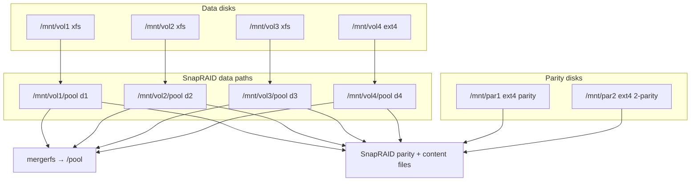

# Disks (SnapRAID + mergerfs)

NAS-DEV stores bulk data on six 20 TB SATA drives behind an LSI SAS 9300-8i HBA. SnapRAID provides 2-parity protection over four data disks; mergerfs presents a single `/pool` mount for Samba, Docker, backups, and VMs.

## Table of contents

- [Disks (SnapRAID + mergerfs)](#disks-snapraid--mergerfs)
  - [Table of contents](#table-of-contents)
  - [Overview](#overview)
  - [Architecture](#architecture)
  - [Disk inventory](#disk-inventory)
  - [Live disk mapping](#live-disk-mapping)
  - [Initial setup: individual disks](#initial-setup-individual-disks)
  - [SnapRAID setup](#snapraid-setup)
  - [mergerfs setup](#mergerfs-setup)
  - [Maintenance](#maintenance)
  - [SMART health checks](#smart-health-checks)
    - [Manual checks](#manual-checks)
  - [Replacing a failed drive](#replacing-a-failed-drive)

## Overview

| Layer                    | Role                                                                    |
|--------------------------|-------------------------------------------------------------------------|
| 4 data disks (`d1`-`d4`) | User files under `/mnt/vol{1-4}/pool`                                   |
| 2 parity disks           | SnapRAID parity files on `/mnt/par1`, `/mnt/par2`                       |
| mergerfs                 | Combines `vol1/pool` through `vol4/pool` into `/pool`                   |
| SnapRAID                 | Parity protection, nightly sync (via [backup](backup.md)), weekly scrub |

Related docs:

- [Backup](backup.md) - nightly SnapRAID sync and off-site copies
- [New user setup](new_user.md) - `hosted` group for pool permissions
- [Jellyfin](jellyfin.md) - permissions on `/pool`
- [Hosted Services VM](hosted_services_vm.md) - virtiofs shares `/pool` into VMs

## Architecture



- Each data disk mounts at `/mnt/volX`; SnapRAID protects only the `pool/` subdirectory on each.
- Parity disks use `fsck` pass `0` in fstab (parity blobs, not user files).
- System disk (Samsung 990 PRO 4 TB NVMe, `/`, ext4) is separate from the array.

## Disk inventory

`/dev/sdX` names are not stable across reboots or HBA port changes. Use UUIDs in fstab and run [`list_disks.sh`](../nas-dev/scripts/list_disks.sh) on the live host to map serials and device nodes.

| Label | Role      | Mount       | SnapRAID path     | Filesystem | Make            | Model        | Model ID              | Purchased  | Cost (USD) |
|-------|-----------|-------------|-------------------|------------|-----------------|--------------|-----------------------|------------|------------|
| VOL1  | data `d1` | `/mnt/vol1` | `/mnt/vol1/pool`  | xfs        | Seagate         | IronWolf Pro | ST20000NE000-3G5101   | 2025-01-31 | 290        |
| VOL2  | data `d2` | `/mnt/vol2` | `/mnt/vol2/pool`  | xfs        | Western Digital | Red          | WDC WD201KFGX-68BKJN0 | 2022-11-28 | 341        |
| VOL3  | data `d3` | `/mnt/vol3` | `/mnt/vol3/pool`  | xfs        | Western Digital | Red          | WDC WD201KFGX-68BKJN0 | 2022-11-28 | 341        |
| VOL4  | data `d4` | `/mnt/vol4` | `/mnt/vol4/pool`  | ext4       | MDD             | NAS          | —                     | 2025-10-15 | 290        |
| PAR1  | parity    | `/mnt/par1` | `snapraid.parity` | ext4       | Seagate         | Exos X20     | ST20000NM007D-3DJ103  | 2025-08-22 | 240        |
| PAR2  | 2-parity  | `/mnt/par2` | `snapraid.parity` | ext4       | Seagate         | IronWolf Pro | ST20000NE000-3G5101   | 2025-01-31 | 290        |

See also the [hard drives table](../README.md#hard-drives) in the README for purchase history.

## Live disk mapping

```bash
sudo bash nas-dev/scripts/list_disks.sh
```

The script prints disk size, model, serial, WWN, filesystem, UUID, and mount point for every block device.

To map a specific drive manually:

```bash
sudo blkid
lsblk -o NAME,SIZE,MODEL,SERIAL,FSTYPE,LABEL,UUID,MOUNTPOINT
```

## Initial setup: individual disks

1. Install packages:

   ```bash
   sudo apt install snapraid mergerfs smartmontools xfsprogs
   ```

2. Partition and format each drive:

   | Disks            | Filesystem | Mount                        | Options   |
   |------------------|------------|------------------------------|-----------|
   | vol1-vol3        | xfs        | `/mnt/vol{1-3}`              | `noatime` |
   | vol4, par1, par2 | ext4       | `/mnt/vol4`, `/mnt/par{1-2}` | `noatime` |

3. Create data subdirectories:

   ```bash
   sudo mkdir -p /mnt/vol{1,2,3,4}/pool
   ```

4. Add fstab entries from [`nas-dev/etc/fstab`](../nas-dev/etc/fstab). Replace UUIDs with values from `sudo blkid`.

5. Mount and verify:

   ```bash
   sudo mount -a
   df -h /mnt/vol{1,2,3,4} /mnt/par{1,2}
   ```

## SnapRAID setup

Copy [`nas-dev/etc/snapraid.conf`](../nas-dev/etc/snapraid.conf) to `/etc/snapraid.conf`.

Key settings:

| Directive      | Path / value                            |
|----------------|-----------------------------------------|
| `parity`       | `/mnt/par1/snapraid.parity`             |
| `2-parity`     | `/mnt/par2/snapraid.parity`             |
| `content`      | One file each on vol1-vol4 plus par1    |
| `data d1`-`d4` | `/mnt/vol{1-4}/pool`                    |
| `autosave`     | `250` (GB checkpoint during long syncs) |

Routine commands:

```bash
snapraid status
snapraid sync              # update parity after file changes
snapraid -p 10 scrub       # verify parity (weekly via cron)
```

On first setup or after adding drives, `snapraid sync` can take many hours.

## mergerfs setup

Add the mergerfs line from [`nas-dev/etc/fstab`](../nas-dev/etc/fstab) to `/etc/fstab`:

```fstab
/mnt/vol1/pool:/mnt/vol2/pool:/mnt/vol3/pool:/mnt/vol4/pool  /pool  fuse.mergerfs  allow_other,use_ino,default_permissions,category.create=epmfs,minfreespace=20G,moveonenospc=true,func.getattr=newest,cache.files=auto-full,cache.attr=30,dropcacheonclose=true,parallel-direct-writes=true,fsname=pool  0 0
```

Notable options (full comments are in the fstab file):

| Option                  | Purpose                                                            |
|-------------------------|--------------------------------------------------------------------|
| `category.create=epmfs` | New files on existing path, most free space                        |
| `minfreespace=20G`      | Stop writing to drives below 20 GB free                            |
| `default_permissions`   | Kernel enforces POSIX permissions before mergerfs (good for Samba) |
| `func.getattr=newest`   | Newest metadata wins (helps SnapRAID sync timing)                  |
| `moveonenospc=true`     | Move files when a drive fills up                                   |

Verify:

```bash
mount | grep pool
df -h /pool
```

## Maintenance

Cron schedules and backup integration are documented in [backup.md](backup.md#cron-schedule).

| Script | Active | Role |
| ------ | ------ | ---- |
| [`cron_backup.sh`](../nas-dev/scripts/cron_backup.sh) | yes (daily 00:00) | SnapRAID status + sync, then rclone |
| [`snapraid_scrub.sh`](../nas-dev/scripts/snapraid_scrub.sh) | yes (Sun 03:00) | status + 10% scrub, email result |

Scrub emails `snapraid@bitrealm.dev`. The backup script emails `nas-dev@bitrealm.dev`.

## SMART health checks

For a GUI view of SMART data on all array drives:

```bash
sudo gsmartcontrol
```

### Manual checks

```bash
sudo smartctl --scan
sudo smartctl -H -A /dev/sdX
sudo smartctl -a /dev/sdX
```

Use [`list_disks.sh`](../nas-dev/scripts/list_disks.sh) to correlate `/dev/sdX` with model and serial before running `smartctl` on a specific drive.

## Replacing a failed drive

1. Replace the hardware and format the new drive (same filesystem and mount point as the failed disk).
2. Restore the fstab UUID entry and mount at the original path (`/mnt/volX` or `/mnt/parX`).
3. For a data disk: copy recovered data back if available, then run `snapraid fix` and `snapraid sync` per the [SnapRAID recovery guide](https://www.snapraid.it/recover).
4. For a parity disk: run `snapraid sync` to rebuild parity.

Keep at least one spare content file intact during recovery. Content files live on vol1-vol4 and par1.
