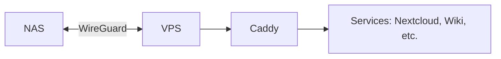
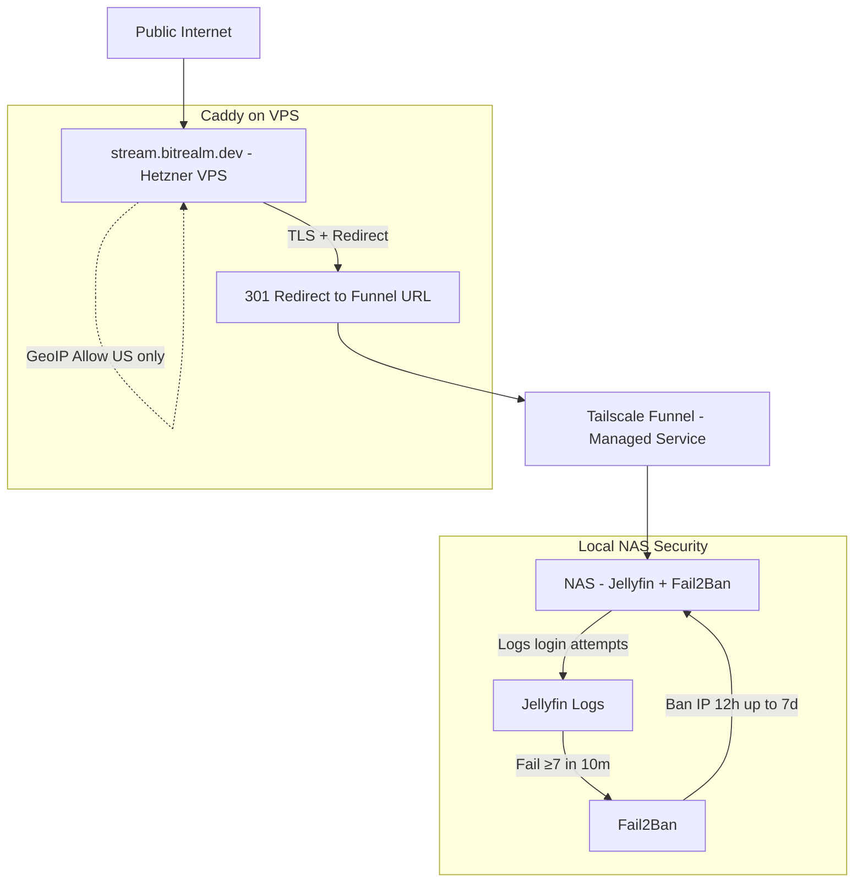

# Network

```mermaid
graph LR
  NAS[NAS] <-->|WireGuard| VPS[VPS]
  VPS --> Caddy[Caddy]
  Caddy --> Services[Services: Nextcloud, Wiki, etc.]
```

```mermaid
flowchart TD
    A[ Public Internet] --> B[stream.bitrealm.dev - Hetzner VPS]

    subgraph VPS[Caddy on VPS]
        B -->|TLS + Redirect| C[301 Redirect to Funnel URL]
        B -.->|Block POST/PUT/PATCH/DELETE → 405| B
        B -.->|Block Bot UAs → 403| B
        B -.->|Rate-limit 120/min/IP → 429| B
        B -.->|GeoIP Allow US only| B
    end

    C --> D[Tailscale Funnel - Managed Service]
    D --> E[NAS - Jellyfin + Fail2Ban]

    subgraph NAS[Local NAS Security]
        E -->|Logs login attempts| F[Jellyfin Logs]
        F -->|Fail ≥7 in 10m| G[Fail2Ban]
        G -->|Ban IP 12h up to 7d| E
    end
```
