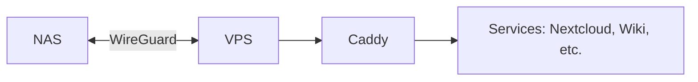

# Network



```mermaid
flowchart TD
    A[🌐 Public Internet] --> B[stream.bitrealm.dev<br/>(Hetzner VPS)]

    subgraph VPS[Caddy on VPS]
        B -->|TLS + Redirect| C[301 Redirect<br/>to Funnel URL]
        B -.->|Block POST/PUT/PATCH/DELETE → 405| B
        B -.->|Block Bot UAs → 403| B
        B -.->|Rate-limit 120/min/IP → 429| B
        B -.->|GeoIP Allow US only| B
    end

    C --> D[Tailscale Funnel<br/>(Managed Service)]
    D --> E[NAS<br/>Jellyfin + Fail2Ban]

    subgraph NAS[Local NAS Security]
        E -->|Logs login attempts| F[Jellyfin Logs]
        F -->|Fail ≥7 in 10m| G[Fail2Ban]
        G -->|Ban IP 12h (up to 7d)| E
    end

    style A fill:#f8f8f8,stroke:#333,stroke-width:1px
    style B fill:#d0ebff,stroke:#0366d6,stroke-width:2px
    style VPS stroke:#0366d6,stroke-width:2px
    style C fill:#e8f7e4,stroke:#22863a,stroke-width:2px
    style D fill:#fff3cd,stroke:#ff9900,stroke-width:2px
    style E fill:#fdd,stroke:#d73a49,stroke-width:2px
    style NAS stroke:#d73a49,stroke-width:2px
    style G fill:#ffd6d6,stroke:#d73a49,stroke-width:2px
```
