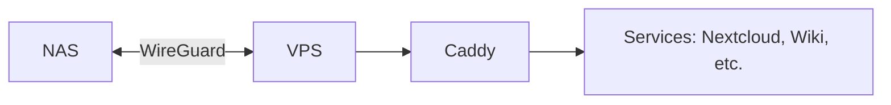

# Network



```mermaid
flowchart TD
  %% NODES
  A[🌐 Public Internet]
  B[stream.bitrealm.dev<br/>(Caddy on VPS)]
  C[301 Redirect → Funnel URL]
  D[Tailscale Funnel<br/>(managed by Tailscale)]
  E[NAS<br/>Jellyfin + Fail2Ban]
  F[Jellyfin Logs]
  G[Fail2Ban]

  %% FLOWS
  A --> B
  B -->|TLS + Redirect| C
  C --> D
  D --> E

  %% VPS-SIDE GUARDS (self-loops to show pre-redirect filters)
  B -.->|Block POST/PUT/PATCH/DELETE → 405| B
  B -.->|Block Bot UAs → 403| B
  B -.->|Rate-limit 120/min/IP → 429| B
  %% (Optional) Geo gate — add back when DB is present:
  %% B -.->|GeoIP allow US only| B

  %% NAS-SIDE PROTECTION
  E -->|Logs login attempts| F
  F -->|≥7 fails in 10m| G
  G -->|Ban IP 12h (up to 7d)| E

  %% STYLES (classes work across renderers better than 'style' on subgraphs)
  classDef internet fill:#f8f8f8,stroke:#333,stroke-width:1px;
  classDef vps fill:#d0ebff,stroke:#0366d6,stroke-width:2px;
  classDef ok fill:#e8f7e4,stroke:#22863a,stroke-width:2px;
  classDef funnel fill:#fff3cd,stroke:#ff9900,stroke-width:2px;
  classDef nas fill:#ffe5e5,stroke:#d73a49,stroke-width:2px;
  classDef jail fill:#ffd6d6,stroke:#d73a49,stroke-width:2px;

  class A internet;
  class B vps;
  class C ok;
  class D funnel;
  class E nas;
  class F nas;
  class G jail;
```
