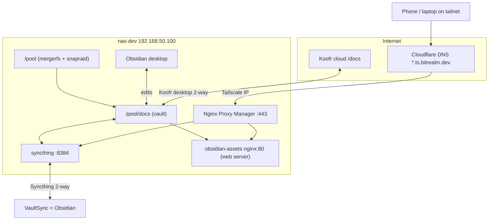

# Obsidian — NAS vault and iPhone sync

Personal notes live in a plain folder on the NAS, backed up to Koofr cloud, and synced to an iPhone. Obsidian is just the editor — the vault is `/pool/docs`.

Related: [Backup](backup.md) · [Tailscale + NPM](tailscale.md) · [bitrealm.dev DNS](bitrealm_dev.md) · [Router DNS](router.md) · [Disks / pool](disks.md) · [User permissions](new_user.md)

## Table of contents

- [Why Obsidian (not Joplin)](#why-obsidian-not-joplin)
- [Overview](#overview)
- [Network architecture](#network-architecture)
- [Key paths](#key-paths)
- [Docker](#docker)
- [HTTPS hostnames](#https-hostnames)
- [iPhone setup](#iphone-setup)
- [Large files without bloating the phone](#large-files-without-bloating-the-phone)
- [What did not work](#what-did-not-work)
- [Gotchas](#gotchas)
- [Rebuild from scratch](#rebuild-from-scratch)

## Why Obsidian (not Joplin)

Joplin kept notes in its own database, separate from the rest of my docs on Koofr. Obsidian opens a folder of Markdown files — the same files Koofr syncs, that Syncthing sends to my phone, and that nginx can serve as static assets. Better HTML preview and plugins were a bonus.

## Overview

`nas-dev` (`192.168.50.100`) is the homelab hub. All bulk storage lives under `/pool` (mergerfs over four 20 TB disks). The Obsidian vault is `/pool/docs` — a subdirectory of that pool, not a separate silo. Obsidian desktop on the NAS edits those Markdown files directly. The Koofr desktop app keeps `/pool/docs` in 2-way sync with Koofr cloud `/docs/`, so edits from any PC with Koofr propagate to the NAS. Syncthing pushes the same vault to an iPhone via VaultSync. Docker services on the NAS (Syncthing, obsidian-assets, and others) are exposed through Nginx Proxy Manager — on the LAN or remotely over Tailscale.

| Piece | Role |
| ----- | ---- |
| **NAS (`nas-dev`)** | Central host; `/pool` storage; Docker; Obsidian desktop; Tailscale node |
| **`/pool`** | `/pool` — mergerfs + SnapRAID; entire homelab data pool, Koofr-synced off-site |
| **`/pool/docs`** | `/pool/docs` — Obsidian vault (Markdown notes) |
| **Koofr cloud** | Cloud copy of docs; 2-way sync via Koofr desktop app on NAS |
| **Nginx Proxy Manager** | Reverse proxy + TLS on `:443`; routes HTTPS to backend services |
| **Obsidian (desktop)** | Editor on NAS; opens `/pool/docs` as the vault |
| **Syncthing** | 2-way sync of vault with iPhone (VaultSync) |
| **obsidian-assets** | nginx web server (`:80`) serving `/pool/docs` read-only for large file links |
| **iPhone** | Obsidian + VaultSync; subset of vault synced from NAS |

Nightly backup also pulls Koofr → `/pool/docs/` via rclone ([backup.md](backup.md)) as a restore path. Day-to-day sync is the Koofr desktop app; if NAS and cloud disagree after a nightly pull, Koofr wins.

## Network architecture

| Path | How |
| ---- | --- |
| **LAN** | `*.bitrealm.dev` → NPM on `nas-dev` ([router.md](router.md#dnsmasq) for local DNS) |
| **Remote** | Tailscale client → `*.ts.bitrealm.dev` (Cloudflare A → Tailscale IP) → NPM → same backends ([tailscale.md](tailscale.md)) |
| **Vault edits on NAS** | Obsidian opens `/pool/docs` directly; files land on mergerfs `/pool` |
| **Cloud sync** | Koofr desktop app 2-way syncs `/pool/docs` ↔ Koofr cloud `/docs/` |
| **Phone sync** | Syncthing ↔ VaultSync on iPhone (2-way); folder `/obsidian` mounts `/pool/docs` |
| **Large assets** | `obsidian-assets` nginx serves `/pool/docs` read-only; notes link `https://obsidian-assets.ts.bitrealm.dev/...` |

### NPM services

Configure proxy hosts in [Nginx Proxy Manager](tailscale.md#step-4-add-proxy-host-in-npm). Primary remote access is over **Tailscale** (`.ts.bitrealm.dev`). Add the matching LAN name on the same proxy host for local access without Tailscale.

| Service | LAN hostname | Tailscale hostname | Backend |
| ------- | ------------ | ------------------ | ------- |
| Syncthing | `obsidian-sync.bitrealm.dev` | `obsidian-sync.ts.bitrealm.dev` | `:8384` |
| Asset server | `obsidian-assets.bitrealm.dev` | `obsidian-assets.ts.bitrealm.dev` | `obsidian-assets:80` (web server) |

LAN DNS on the router ([dnsmasq](router.md#dnsmasq)) is only needed for the non-`.ts` names. Tailscale hostnames use the Cloudflare `*.ts` wildcard ([bitrealm.dev](bitrealm_dev.md)).

### `/pool` storage

`/pool` is more than the Obsidian vault:

- mergerfs + SnapRAID over four 20 TB disks ([disks.md](disks.md))
- `/pool` — homelab data pool
- `/pool/docs` — Obsidian vault (Koofr-synced)
- `/pool/archive`, `/pool/docker_archive` — other backup targets ([backup.md](backup.md))
- Koofr cloud mirrors much of `/pool` off-site

## Key paths

| What | Where |
| ---- | ----- |
| Vault | `/pool/docs` |
| Syncthing config | `/opt/syncthing/config` |
| Syncthing folder path **in the UI** | `/obsidian` (container mount name, not `/pool/docs`) |
| Syncthing web UI | `https://obsidian-sync.ts.bitrealm.dev` (Tailscale; LAN: `obsidian-sync.bitrealm.dev` or `:8384`) |
| Asset links in notes | `https://obsidian-assets.ts.bitrealm.dev/...` |

Syncthing metadata inside the vault: `.stfolder/`, `.stignore`, `.stversions/`.

`.stignore` skips `_assets/` (heavy exports) but still syncs `_resources/` and normal notes.

## Docker

| Service | Compose |
| ------- | ------- |
| Syncthing | [`nas-dev/docker/syncthing/compose.yml`](../nas-dev/docker/syncthing/compose.yml) |
| Asset web server | [`nas-dev/docker/nginx-proxy-manager/compose.yml`](../nas-dev/docker/nginx-proxy-manager/compose.yml) (`obsidian-assets` service) |
| nginx config (directory listing) | [`obsidian-assets-conf/default.conf`](../nas-dev/docker/nginx-proxy-manager/obsidian-assets-conf/default.conf) |

Syncthing runs as user `1000`, group `20250` (`hosted`) so new files match the pool.

Mount in compose: `/pool/docs:/obsidian`.

`obsidian-assets` reads `/pool/docs` read-only and enables directory browsing (useful when writing asset URLs).

## HTTPS hostnames

Obsidian-specific proxy hosts (also listed under [NPM services](#npm-services) above):

| Hostname (primary) | Also on same cert (optional) | Points to | Port |
| ---------------- | ---------------------------- | --------- | ---- |
| `obsidian-sync.ts.bitrealm.dev` | `obsidian-sync.bitrealm.dev` | NAS Syncthing | `8384` |
| `obsidian-assets.ts.bitrealm.dev` | `obsidian-assets.bitrealm.dev` | `obsidian-assets` container | `80` |

## iPhone setup

1. Install **Obsidian** and **VaultSync**.
2. Create a vault in Obsidian.
3. In **VaultSync**, add the NAS as a device.
4. In Syncthing on the NAS (`https://obsidian-sync.ts.bitrealm.dev`), add the iPhone (LAN or Tailscale).
5. **Both sides must accept** — pair devices on each end.
6. Shared folder on NAS: `/obsidian`.

## Large files without bloating the phone

Message exports and similar projects put big files under `_assets/`. Notes link to them as:

`https://obsidian-assets.ts.bitrealm.dev/<path-under-pool-docs>`

Files stay in the right folder on disk; the phone loads them in a browser when needed. Alternative to hosting on Cloudflare R2.

## What did not work

| Tried | Problem |
| ----- | ------- |
| Koofr via rclone mount | Bad with Syncthing |
| Koofr WebDAV | Too slow |
| Syncing all assets to iPhone | Huge vault, slow, VaultSync keeps disconnecting |

## Gotchas

- **Case-only renames** (`test_dir` → `Test_dir`) confuse Koofr and Syncthing. Avoid.
- **Rename on Koofr web** first; let changes flow down to the NAS — not the other way around.
- **If casing must be fixed:** stop Syncthing, delete the vault on the iPhone, resync from scratch.

## Rebuild from scratch

1. Create `/pool/docs` with `hosted` group permissions ([new_user.md](new_user.md)).
2. Install Koofr desktop client; sync cloud `/docs/` ↔ `/pool/docs`.
3. Start Syncthing from [`syncthing/compose.yml`](../nas-dev/docker/syncthing/compose.yml).
4. Start `obsidian-assets` from the NPM compose stack.
5. Add NPM proxy hosts + TLS for `obsidian-sync.ts.bitrealm.dev` and `obsidian-assets.ts.bitrealm.dev` (optionally add LAN names on the same hosts).
6. If using LAN names, add router DNS for `obsidian-sync.bitrealm.dev` and `obsidian-assets.bitrealm.dev`.
7. In Syncthing: add folder `/obsidian`, configure `.stignore`, pair iPhone.
8. On iPhone: Obsidian vault + VaultSync pointed at the NAS folder.
9. Confirm nightly backup still pulls Koofr docs ([backup.md](backup.md)).
10. Test: edit on phone → shows on NAS; edit via Koofr on another PC → shows on NAS.
