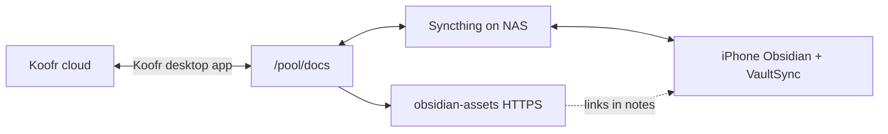

# Obsidian — NAS vault and iPhone sync

Personal notes live in a plain folder on the NAS, backed up to Koofr cloud, and synced to an iPhone. Obsidian is just the editor — the vault is `/pool/docs`.

Related: [Backup](backup.md) · [Tailscale + NPM](tailscale.md) · [bitrealm.dev DNS](bitrealm_dev.md) · [Router DNS](router.md) · [User permissions](new_user.md)

## Why Obsidian (not Joplin)

Joplin kept notes in its own database, separate from the rest of my docs on Koofr. Obsidian opens a folder of Markdown files — the same files Koofr syncs, that Syncthing sends to my phone, and that nginx can serve as static assets. Better HTML preview and plugins were a bonus.

## Overview

| Piece | Role |
| ----- | ---- |
| **Koofr** | Cloud copy of docs; edit from any PC with the Koofr app |
| **`/pool/docs`** | Vault on the NAS |
| **Syncthing** | Syncs the vault to iPhone (VaultSync) |
| **obsidian-assets** | Large files at `https://obsidian-assets.ts.bitrealm.dev/...` (Tailscale) |

Nightly backup also pulls Koofr → `/pool/docs/` ([backup.md](backup.md)). Koofr wins if NAS and cloud disagree.

## Key paths

| What | Where |
| ---- | ----- |
| Vault | `/pool/docs` |
| Syncthing config | `/opt/syncthing/config` |
| Syncthing folder path **in the UI** | `/obsidian` (container mount name, not `/pool/docs`) |
| Syncthing web UI | `https://obsidian-sync.ts.bitrealm.dev` (Tailscale; LAN: `obsidian-sync.bitrealm.dev` or `:8384`) |
| Asset links in notes | `https://obsidian-assets.ts.bitrealm.dev/...` |

Syncthing metadata inside the vault: `.stfolder/`, `.stignore`, `.stversions/`.

`.stignore` skips `_assets/` (heavy exports) but still syncs `_resources/` and normal notes.

## Docker

| Service | Compose |
| ------- | ------- |
| Syncthing | [`nas-dev/docker/syncthing/compose.yml`](../nas-dev/docker/syncthing/compose.yml) |
| Asset web server | [`nas-dev/docker/nginx-proxy-manager/compose.yml`](../nas-dev/docker/nginx-proxy-manager/compose.yml) (`obsidian-assets` service) |
| nginx config (directory listing) | [`obsidian-assets-conf/default.conf`](../nas-dev/docker/nginx-proxy-manager/obsidian-assets-conf/default.conf) |

Syncthing runs as user `1000`, group `20250` (`hosted`) so new files match the pool.

Mount in compose: `/pool/docs:/obsidian`.

## HTTPS hostnames

Configure in [Nginx Proxy Manager](tailscale.md#step-4-add-proxy-host-in-npm). Primary access is over **Tailscale** (`.ts.bitrealm.dev`). Add the matching LAN name on the same proxy host if you want local access without Tailscale.

| Hostname (primary) | Also on same cert (optional) | Points to | Port |
| ---------------- | ---------------------------- | --------- | ---- |
| `obsidian-sync.ts.bitrealm.dev` | `obsidian-sync.bitrealm.dev` | NAS Syncthing | `8384` |
| `obsidian-assets.ts.bitrealm.dev` | `obsidian-assets.bitrealm.dev` | `obsidian-assets` container | `80` |

LAN DNS on the router ([dnsmasq](router.md#dnsmasq)) is only needed for the non-`.ts` names. Tailscale hostnames use the Cloudflare `*.ts` wildcard ([bitrealm.dev](bitrealm_dev.md)).

`obsidian-assets` reads `/pool/docs` read-only and enables directory browsing (useful when writing asset URLs).

## iPhone setup

1. Install **Obsidian** and **VaultSync**.
2. Create a vault in Obsidian.
3. In **VaultSync**, add the NAS as a device.
4. In Syncthing on the NAS (`https://obsidian-sync.ts.bitrealm.dev`), add the iPhone (LAN or Tailscale).
5. **Both sides must accept** — pair devices on each end.
6. Shared folder on NAS: `/obsidian`.

## Large files without bloating the phone

Message exports and similar projects put big files under `_assets/`. Notes link to them as:

`https://obsidian-assets.ts.bitrealm.dev/<path-under-pool-docs>`

Files stay in the right folder on disk; the phone loads them in a browser when needed. Alternative to hosting on Cloudflare R2.

## What did not work

| Tried | Problem |
| ----- | ------- |
| Koofr via rclone mount | Bad with Syncthing |
| Koofr WebDAV | Too slow |
| Syncing all assets to iPhone | Huge vault, slow, VaultSync keeps disconnecting |

## Gotchas

- **Case-only renames** (`test_dir` → `Test_dir`) confuse Koofr and Syncthing. Avoid.
- **Rename on Koofr web** first; let changes flow down to the NAS — not the other way around.
- **If casing must be fixed:** stop Syncthing, delete the vault on the iPhone, resync from scratch.

## Rebuild from scratch

1. Create `/pool/docs` with `hosted` group permissions ([new_user.md](new_user.md)).
2. Install Koofr desktop client; sync cloud `/docs/` ↔ `/pool/docs`.
3. Start Syncthing from [`syncthing/compose.yml`](../nas-dev/docker/syncthing/compose.yml).
4. Start `obsidian-assets` from the NPM compose stack.
5. Add NPM proxy hosts + TLS for `obsidian-sync.ts.bitrealm.dev` and `obsidian-assets.ts.bitrealm.dev` (optionally add LAN names on the same hosts).
6. If using LAN names, add router DNS for `obsidian-sync.bitrealm.dev` and `obsidian-assets.bitrealm.dev`.
7. In Syncthing: add folder `/obsidian`, configure `.stignore`, pair iPhone.
8. On iPhone: Obsidian vault + VaultSync pointed at the NAS folder.
9. Confirm nightly backup still pulls Koofr docs ([backup.md](backup.md)).
10. Test: edit on phone → shows on NAS; edit via Koofr on another PC → shows on NAS.
