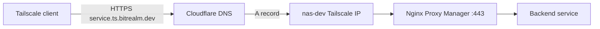

# Tailscale + Nginx Proxy Manager Setup

Remote homelab access uses Tailscale and Nginx Proxy Manager (NPM) on `nas-dev`. Domain naming and DNS are documented in [bitrealm.dev](bitrealm_dev.md).

## Overview

| Component | Host | Role |
| --------- | ---- | ---- |
| Tailscale | `nas-dev` | Private network; tailnet IP receives HTTPS for `*.ts.bitrealm.dev` |
| Nginx Proxy Manager | `nas-dev` (`nas-dev/docker/networking`) | Reverse proxy, TLS termination, routes to backend services |
| Cloudflare DNS | `bitrealm.dev` zone | `*.ts.bitrealm.dev` A record points at `nas-dev` Tailscale IP (DNS only) |

Homelab services are **not** exposed via Cloudflare Tunnel. See [Hosted Services](hosted_services_vm.md) for the legacy cloudflared approach.

## Architecture



| Access path | Hostname pattern | DNS | Traffic |
| ----------- | ---------------- | --- | ------- |
| Remote (tailnet) | `<service>.ts.bitrealm.dev` | Cloudflare `*.ts.bitrealm.dev` → Tailscale IP | Client → Tailscale → NPM → service |
| LAN (optional) | `<service>.bitrealm.dev` | Router [dnsmasq](router.md#dnsmasq) → `192.168.50.100` | LAN → NPM → service (no Tailscale) |

Remote access requires the client to be on the tailnet. There is no public-internet path to homelab services.

---

## Step 1: Tailscale on nas-dev

NPM and Tailscale both run on `nas-dev`. Enable IP forwarding so `nas-dev` can route tailnet traffic to LAN services if needed.

```bash
echo 'net.ipv4.ip_forward = 1' | sudo tee -a /etc/sysctl.d/99-tailscale.conf
echo 'net.ipv6.conf.all.forwarding = 1' | sudo tee -a /etc/sysctl.d/99-tailscale.conf
sudo sysctl -p /etc/sysctl.d/99-tailscale.conf
```

See [Router - Tailscale](router.md#tailscale) for IP forwarding commands and background on subnet routing.

In the [Tailscale admin console](https://login.tailscale.com/admin/machines):

1. Confirm `nas-dev` is connected.
2. Note the Tailscale IPv4 address (`tailscale ip -4` on `nas-dev`). Currently `100.94.65.10`.
3. If backends live on other LAN subnets, enable **subnet routes** for `nas-dev` and approve them under **Routing**.

---

## Step 2: Cloudflare DNS record

Add one wildcard record in the Cloudflare dashboard for zone `bitrealm.dev`:

| Type | Name | Value | Proxy |
| ---- | ---- | ----- | ----- |
| A | `*.ts` | `nas-dev` Tailscale IPv4 (e.g. `100.94.65.10`) | DNS only (grey cloud) |

Do **not** enable Cloudflare proxy (orange cloud). TLS is terminated by NPM, not Cloudflare.

Full zone context: [bitrealm.dev - DNS records](bitrealm_dev.md#dns-records).

### Verify

```bash
nslookup jellyfin.ts.bitrealm.dev 1.1.1.1
```

Should return the `nas-dev` Tailscale IP, not a Cloudflare anycast address.

---

## Step 3: Nginx Proxy Manager on nas-dev

NPM runs in Docker via `nas-dev/docker/networking/compose.yml`:

| Port | Purpose |
| ---- | ------- |
| 80 | HTTP (redirects to HTTPS when Force SSL enabled) |
| 443 | HTTPS reverse proxy |
| 81 | Admin UI |

LAN admin UI: `http://192.168.50.100:81`

No Cloudflare Tunnel container is required for this setup. The `cloudflared-tunnel` service in the compose file is legacy and unused.

---

## Step 4: Cloudflare API token (Let's Encrypt DNS challenge)

NPM requests certificates using Let's Encrypt with Cloudflare DNS validation.

1. Go to **Cloudflare Dashboard** → **My Profile** → **API Tokens**
2. Click **Create Token**
3. Set permissions:
   - **Zone** → **DNS** → **Edit**
   - **Zone Resources:** Include → Specific zone → `bitrealm.dev`
4. **Create Token** and copy the token (shown only once)

---

## Step 5: Add proxy host in NPM

For each service (example: Jellyfin on port `8096`):

1. Go to **Proxy Hosts** → **Add Proxy Host**
2. **Domain Names:** `<service>.ts.bitrealm.dev` (e.g. `jellyfin.ts.bitrealm.dev`)
3. **Scheme:** `http`
4. **Forward Hostname/IP:** `127.0.0.1` or `192.168.50.100` (host where the service listens)
5. **Forward Port:** service port (e.g. `8096` for Jellyfin)
6. Open the **SSL** tab (Step 6)

Use the `.ts.bitrealm.dev` suffix so the hostname matches the Cloudflare wildcard A record.

---

## Step 6: Request Let's Encrypt certificate

In the **SSL** tab of the proxy host:

1. **Certificate:** Request a new SSL Certificate
2. **DNS Provider:** Cloudflare
3. **Credentials File Content:** paste the API token from Step 4
4. **Propagation Seconds:** leave empty (default)
5. **Email Address:** email for Let's Encrypt notifications
6. Check **Agree to Let's Encrypt Terms of Service**
7. Enable **Force SSL** (recommended)
8. Click **Save**

Wait 2-5 minutes for DNS validation and certificate issuance.

---

## Step 7: Verify remote access

From a device connected to the tailnet (not on LAN-only DNS):

```bash
nslookup jellyfin.ts.bitrealm.dev
curl -I https://jellyfin.ts.bitrealm.dev
```

- DNS should resolve to the `nas-dev` Tailscale IP.
- HTTPS should present a valid Let's Encrypt certificate.
- The backend service should load without certificate warnings.

If DNS resolves but HTTPS fails, check NPM logs and that ports `80`/`443` on `nas-dev` are reachable over Tailscale.

---

## Optional: LAN split DNS (without `.ts`)

LAN clients can reach NPM at `192.168.50.100` using `<service>.bitrealm.dev` (no `.ts`). **dnsmasq runs on the router**, not on `nas-dev`. Follow the canonical procedure in [Router - dnsmasq](router.md#dnsmasq).

Summary:

1. Enable **JFFS custom scripts and configs** on the router ([Router - Administration](router.md#administration)).
2. SSH to `bitadmin@192.168.50.1` and append to `/jffs/configs/dnsmasq.conf.add`:

   ```
   address=/jellyfin.bitrealm.dev/192.168.50.100
   address=/jellyfin.bitrealm.dev/::1
   ```

3. Run `service restart_dnsmasq` on the router.
4. Add a separate NPM proxy host for `jellyfin.bitrealm.dev` (LAN hostname, no `.ts`).

Verify against the **router** DNS (not Cloudflare):

```bash
nslookup jellyfin.bitrealm.dev 192.168.50.1
```

Should return `192.168.50.100`. Compare with tailnet resolution:

```bash
nslookup jellyfin.ts.bitrealm.dev 1.1.1.1
```

Should return the `nas-dev` Tailscale IP.

---

## Not needed for this setup

| Item | Why skip |
| ---- | -------- |
| Cloudflare Tunnel / `cloudflared` | Remote access is Tailscale-only |
| Per-service Cloudflare DNS records | Wildcard `*.ts.bitrealm.dev` covers all services |
| Cloudflare proxy (orange cloud) on `*.ts` | NPM handles TLS; proxy would break direct Tailscale routing |
| Fastmail / mail DNS records | Unrelated to homelab access - see [bitrealm.dev](bitrealm_dev.md) |

---

## Related docs

- [bitrealm.dev](bitrealm_dev.md) - domain, DNS, and traffic flow
- [Router](router.md) - dnsmasq LAN split DNS, IP forwarding
- [Jellyfin](jellyfin.md) - example backend service
- [Hosted Services](hosted_services_vm.md) - legacy Cloudflare Tunnel approach
